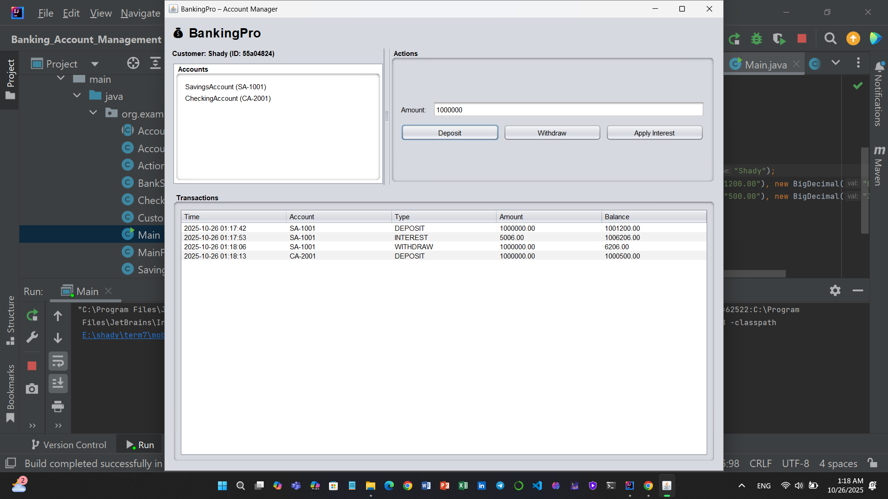

# BankingPro – Java Banking with a Clean Swing UI

A compact, single-folder Java app that demonstrates core OOP concepts in Java (classes, inheritance, conditionals, loops) with a modern, easy-to-screenshot Swing interface. Perfect for learning, showcasing on Git, and extending.

## Highlights

- **Domain & OOP**
  - `Account` (base), `SavingsAccount` (interest), `CheckingAccount` (withdrawal limit), `Customer`, `Transaction`
  - Inheritance, encapsulation, validation, `toString` overrides
- **Business Rules**
  - Deposit/withdraw with positive amount checks  
  - Sufficient funds check  
  - Per-transaction withdrawal **limit** on `CheckingAccount`  
  - Monthly interest application on `SavingsAccount`
- **UI/UX (Swing)**
  - Three panels: **Accounts** (list), **Actions** (amount + buttons), **Transactions** (history table)
  - Toast notifications for quick success feedback
  - Built-in Nimbus look & feel (no external dependencies)
- **Code Style**
  - English-only messages & comments  
  - Clear separation of concerns (domain / service / UI components)


## Project Structure (single folder)

```
.
├─ Account.java
├─ SavingsAccount.java
├─ CheckingAccount.java
├─ Customer.java
├─ Transaction.java
├─ BankService.java
├─ AccountsPanel.java
├─ ActionsPanel.java
├─ TransactionsPanel.java
├─ MainFrame.java
└─ Main.java        <-- entry point
```


## Seed Data

The app seeds two sample accounts at startup:

- **Savings:** `SA-1001` (annual interest **6%**)  
- **Checking:** `CA-2001` (per-transaction withdraw limit **300.00**)


## Using the App

1. Select an account from the **Accounts** list (left).  
2. Enter an amount in **Actions** (right).  
3. Click one of:
   - **Deposit** – increases balance.
   - **Withdraw** – checks limit (Checking) and funds.
   - **Apply Interest** – only for Savings; adds monthly interest.
4. See results in the **Transactions** table (bottom).  
5. Success events show a short toast (auto-dismiss).

**Common validation messages**
- “Amount is required.” / “Amount must be greater than zero.”
- “Please select an account.”
- “Insufficient funds.”
- “Withdrawal exceeds per-transaction limit.”
- “Select a SavingsAccount to apply interest.”


## Screenshots

Add screenshots for your repo:

```
/screenshots/
   ui-main.png
   ui-transaction-history.png
```

Markdown example:
```md
## Screenshot




```

**Tips for a great shot**
- Window around 1200×750  
- Perform one Deposit, one Withdraw, and (on Savings) Apply Interest  
- Ensure the Transactions table shows multiple rows


## Customization

- **Theme:** Nimbus by default. You can later switch to FlatLaf for a more modern look.  
- **Currency:** Format balances with `NumberFormat.getCurrencyInstance()`.  
- **Limits/Interest:** Adjust seed values in `Main.java`.  
- **Persistence:** Currently in-memory. Add file/DB storage if needed.


## Testing Ideas (optional)

- Unit tests for deposit/withdraw edge cases  
- Checking limit enforcement  
- Savings interest calculation


